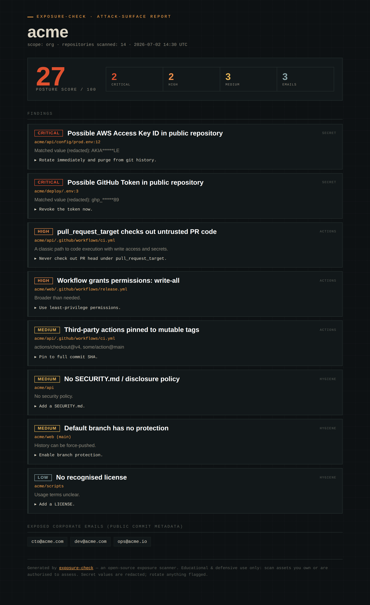
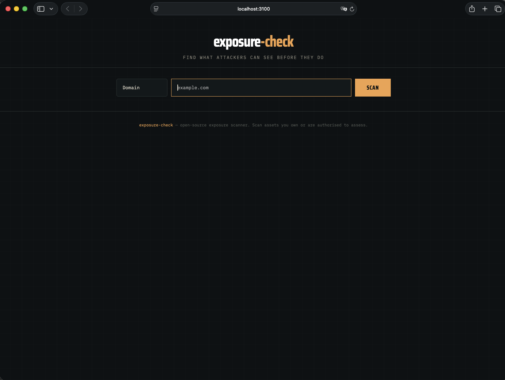
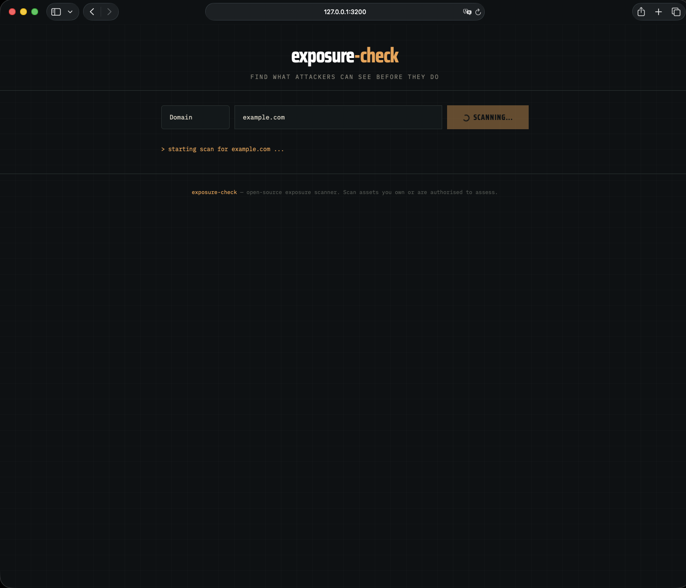
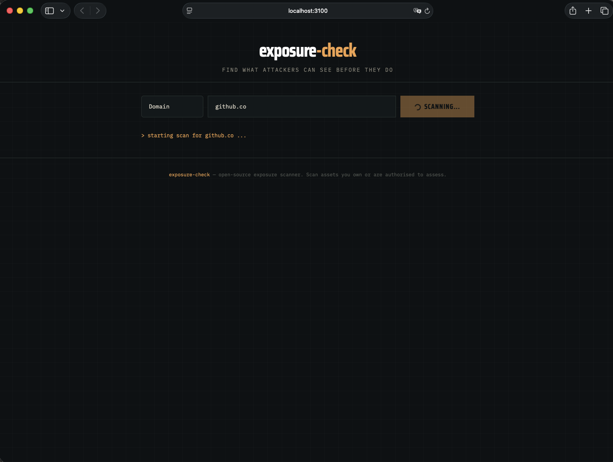

# exposure-check

### Find what attackers can see before they do.

**exposure-check** is a fast, open-source exposure scanner for GitHub
organisations, repositories and developer security posture. It surfaces the
things that quietly leak out of public repos — hard-coded secrets, dangerous
GitHub Actions workflows, missing security controls and exposed corporate emails —
and turns them into a clear report you can act on.



No agents, no SaaS, no account. One static binary (or a GitHub Action). Scan your
own org, get a posture score and a prioritised list of findings, and fix them
before someone else finds them first.

## Web Dashboard

Run `exposure-check serve` to launch an interactive web dashboard where you can
scan domains, GitHub orgs and repos from your browser.

```bash
exposure-check serve                    # http://localhost:3000
exposure-check serve --port 8080        # custom port
```

<p align="center">
  
</p>
<p align="center">
  
</p>
<p align="center">
  
</p>

## Install

```bash
# Go (any platform)
go install github.com/bariskececi/exposure-check@latest

# Docker (multi-arch: amd64 + arm64)
docker run --rm ghcr.io/bariskececi/exposure-check scan --repo owner/repo
docker run --rm ghcr.io/bariskececi/exposure-check:v0.3 scan --domain example.com

# or grab a prebuilt binary from the Releases page
```

Set a token for a full scan (public data only, but it lifts the API rate limit):

```bash
export GITHUB_TOKEN=ghp_...
```

## Usage

```bash
exposure-check scan --github-org acme
exposure-check scan --repo acme/api
exposure-check scan --repo acme/api --format html --output report.html
exposure-check scan --github-org acme --fail-on high        # CI gate
exposure-check scan --repo acme/api --format sarif --output results.sarif  # GitHub Code Scanning
exposure-check scan --github-org acme --verbose             # detailed progress
exposure-check scan --repo acme/api --quiet                 # report only, no noise
```

### Example output

```
  exposure-check  find what attackers can see before they do
  target: acme  ·  scope: org  ·  repos: 14
  ────────────────────────────────────────────────────────────
  Posture score: 27/100
  CRITICAL 2  HIGH 2  MEDIUM 3  LOW 1
  ────────────────────────────────────────────────────────────

  [CRITICAL] Possible AWS Access Key ID in public repository
        ↳ acme/api/config/prod.env:12
        Matched value (redacted): AKIA******LE
        fix: Rotate immediately and purge from git history.

  [HIGH] pull_request_target checks out untrusted PR code
        ↳ acme/api/.github/workflows/ci.yml
        A classic path to code execution with write access and secrets.
        fix: Never check out PR head under pull_request_target.

  [MEDIUM] No SECURITY.md / disclosure policy
        ↳ acme/api
```

The **HTML report** (`--format html`) is a self-contained page with a posture
score, severity tiles and every finding — the thing you paste into a ticket or a
board deck.

## What it checks

**v0.1 — GitHub exposure**

- **Leaked secrets** in public repositories — 30+ patterns covering AWS, Azure,
  GCP, GitHub, Stripe, Slack, Twilio, SendGrid, Shopify, Heroku, DigitalOcean,
  Mailgun, Postmark, Telegram, Discord, PyPI, NPM, private keys, JWTs, database
  connection strings (MongoDB, PostgreSQL, MySQL, Redis, JDBC) and generic
  API-key patterns. Matched values are **redacted** in output — the tool never
  re-publishes a secret.
- **Risky GitHub Actions workflows** — `pull_request_target` checking out untrusted
  PR code, `permissions: write-all`, script injection via `github.event.*`,
  `workflow_dispatch` input injection, self-hosted runners, `ACTIONS_RUNNER_DEBUG`
  left enabled, cross-workflow artifact poisoning, and third-party actions pinned
  to **mutable tags** instead of commit SHAs (the "ambiguous version"
  supply-chain risk).
- **Missing security controls** — no `SECURITY.md` / disclosure policy, no branch
  protection on the default branch, no recognised license.
- **Exposed corporate emails** harvested from public commit metadata.
- **Posture score** (0–100) and severity counts, with **JSON / Markdown / HTML /
  SARIF** reports and a CI-friendly `--fail-on` gate.

## GitHub Action

Gate pull requests on exposure in three lines:

```yaml
- uses: bariskececi/exposure-check@v0.3
  with:
    repo: ${{ github.repository }}
    fail-on: high
```

The Action uses a pre-built GHCR image, so it starts in ~2 seconds instead of
building a Dockerfile on every run.

### Outputs

| Output | Description |
|--------|-------------|
| `score` | Posture score (0–100) |
| `findings` | Total finding count |
| `critical` | Critical finding count |
| `high` | High finding count |
| `report` | Path to report file (if `output` is set) |
| `sarif-file` | Path to SARIF file (if `sarif: true`) |

### Full example with outputs and SARIF

```yaml
name: security
on: [push, pull_request]
jobs:
  exposure:
    runs-on: ubuntu-latest
    permissions:
      contents: read
      security-events: write   # required for SARIF upload
    steps:
      - uses: actions/checkout@v4
      - uses: bariskececi/exposure-check@v0.3
        id: scan
        with:
          repo: ${{ github.repository }}
          fail-on: high
          sarif: true
      - if: always()
        uses: github/codeql-action/upload-sarif@v3
        with:
          sarif_file: ${{ steps.scan.outputs.sarif-file }}
      - if: always()
        run: |
          echo "Score: ${{ steps.scan.outputs.score }}"
          echo "Findings: ${{ steps.scan.outputs.findings }}"
          echo "Critical: ${{ steps.scan.outputs.critical }}"
          echo "High: ${{ steps.scan.outputs.high }}"
```

### Domain scanning in CI

```yaml
- uses: bariskececi/exposure-check@v0.3
  with:
    domain: example.com
    fail-on: high
```

Findings appear as native Code Scanning alerts — no external dashboard needed.

## Roadmap

- ~~**v0.1** — GitHub repo/org scanning, 30+ secret patterns, Actions audit, web dashboard.~~ **Done.**
- ~~**v0.2** — domain & subdomain exposure, typosquatting / look-alike domains,
  public login-panel discovery, TLS certificate checks.~~ **Done.**
- ~~**v0.3** — Docker image on GHCR, richer GitHub Action, CI pass/fail policy.~~ **Done.**
- **v0.4** — OSINT enrichment, optional breach-database lookups, custom rules.
- Later — developer-device & AI/IDE-plugin exposure signals.

Contributions welcome — the checks are small, self-contained Go files.

## Responsible use

exposure-check is a **defensive** tool. Scan assets you own or are explicitly
authorised to assess. It reads only public data, reports findings, and redacts any
secret it detects — it does not exploit, validate or use credentials. You are
responsible for how you use it.

## License

MIT — see [LICENSE](LICENSE). Built by [GNSAC](https://github.com/bariskececi).
